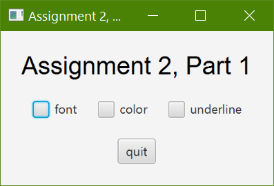
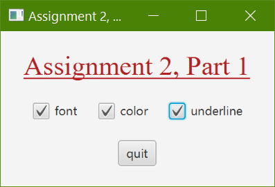
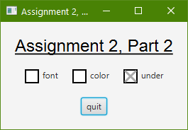
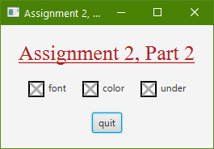

# CS3035 Assignment 2: Widgets and Events in JavaFX

## Due: Friday, October 2, 11:55pm

## Overview

You will build a basic interface with JavaFX widgets, and will write code to handle events that deal with user interaction on those widgets. You will also build a custom widget that uses JavaFX properties as its event-handling mechanism. This assignment will demonstrate your ability to use widgets and widget APIs, to handle basic user-interface events at the application level, and to implement simple 2D graphics for a custom widget.

While we will have touched on all of the topics briefly in lectures and in class meetings, it will be important to review the linked tutorials, to help you put what you have learned into practice.

This assignment is to be done individually; each student will hand in an assignment that is committed to their personal GitHub repo.

## Part 1: An interface with basic widgets and events




### Resources for Part 1

- [Tutorial for the JavaFX Checkbox](https://docs.oracle.com/javafx/2/ui_controls/checkbox.htm)
- [Tutorial for Labels](https://docs.oracle.com/javafx/2/ui_controls/label.htm)
- [Overview of the Font Class](https://www.geeksforgeeks.org/javafx-font-class/)
- [Tutorial for the JavaFX VBox](https://www.tutorialspoint.com/javafx/layout_panes_vbox.htm)
- [Tutorial for JavaFX Button Events](https://docs.oracle.com/javafx/2/events/jfxpub-events.htm) - note that this tutorial does not cover slider widgets, but CheckBox objects also create action events when clicked

### Instructions

Build a simple interface with three checkboxes, a Label, and a Button (see pictures below). Your system should include:

- The Label displays a message ("Assignment 2, Part 1") using a font size larger than the default.
- A Button displays the text “Quit”. When the button is pressed, the program prints “Goodbye!” to the console, and then exits.
- The three checkboxes should be organized horizontally using an HBox layout container.
- The rest of the components in the interface will make use of a VBox for layout, so that it looks like the interface below.
- Your interface should be built using code, not FXML.
- The checkboxes will provide behaviour in the following way:
  - Checkbox 1 (labeled: "font") changes the font of the message to something very different, but of approximately the same size as the original message
  - Checkbox 2 (labeled: "color") changes the messages color to something noticeably different, but still readable
  - Checkbox 3 (labeled: "underline") underlines the message
- When any button is unchecked it should have the same properties as the original label (i.e., if you started off with a black color message, you checked "color" to make it red, and then unchecked it again, it should go back to black)
-the entire message should always be visible, even after resizing

## Part 2: Adding a Custom Widget and Event Handling

### Resources for Part 2

- [Tutorial for the JavaFX Canvas](https://docs.oracle.com/javafx/2/canvas/jfxpub-canvas.htm)
- [Tutorial for JavaFX properties](https://docs.oracle.com/javase/8/javafx/properties-binding-tutorial/binding.htm)

### Instructions

In part 2, you will recreate all functionality of the above example. However, you will not using a CheckBox, instead you will create your own control/widget, called MyCheckBox. Your MyCheckBox will have the same basic functionalities, it can be clicked and when it is, it changes it's internal value to "selected" and displays an X. See the images below.

The goal of part 2 is to give you an appreciation of some of the internals of a widget and how it can be implemented.

Your implementation should meet the following requirements




#### Appearance of MyCheckBox

- The MyCheckBox class displays a square that is 20 pixels high, by 20 pixels wide. With a 2 pixel black border.
- There is no option to add a label to the MyCheckBox class via the constructor like there is with a CheckBox (you will have to manually add a Label object to act as the label of each MyCheckBox)
- When the checkbox is clicked with the mouse it will display a dark grey X to communicate that its "selected" state is true.
  - Note that the X should not cover the border
- MyCheckBox widgets have a fixed size and style, which does not have to change.

#### The MyCheckBox Model - a SimpleBooleanProperty

- Traditionally you might implement the "selected" state of your MyCheckBox as a single boolean variable called "selected"
- However, you will implement a pattern that is common in all JavaFX controls, you will use a [Property](https://docs.oracle.com/javase/8/javafx/properties-binding-tutorial/binding.htm)
- See the methods with the word "Selected" in the JavaFX API for the [CheckBox](https://docs.oracle.com/javafx/2/api/javafx/scene/control/CheckBox.html)
- You will use a SimpleBooleanProperty object to store your selected state
- You should have the following methods to work the selected property

```Java
//you should have the following methods
public BooleanProperty selectedProperty(){...}
public boolean isSelected(){...}
public void setSelected(boolean selected){...}
```

#### Implementation Steps of MyCheckBox

- Your widget should use its own class (MyCheckBox) that inherits from Pane.
- Your widget should use a JavaFX Canvas to draw its graphics.
- Hint: Remember drawing starts relative to the top left corner (the origin: [0,0]), there are a number of ways to deal with this
- You will need to implement an event handler internal to MyCheckBox that handles MouseClick events. When one is received on the MyCheckBox, the selected property (see below) will be toggled (either true or false) and the MyCheckBox display will be updated

#### Event handling

- To keep things simple you will not implement event handling for your MyCheckBox, instead you will add a listener to your selected property
- Similar to the way a JavaFX CheckBox works, add a JavaFX Property to your MyCheckBox implementation. When the value of this property changes, a Listener that has been attached to the property will receive notification of the change.
- See [this tutorial for adding a listener to each of your MyCheckBox objects](https://docs.oracle.com/javafx/2/ui_controls/checkbox.htm)
- You will use these listeners to complete the assignment below.

#### Demonstrating your MyCheckBox

- Update your code from part 1 (i.e., copy your code from your Main class in the part1 package), to use MyCheckBox controls instead of CheckBox objects. 
- You can use additional HBox containers to arrange new Labels beside the MyCheckBox (use spacing appropriately, Labels should be close but not touching the MyCheckBox objects, and should be closer to the corresponding MyCheckBox than to others)
- Use the listeners to update the message as in Part 1, when your MyCheckBox objects are clicked

## Evaluation

Marks will be given for producing a system that meets the requirements above, and compiles and runs without errors. Note that no late assignments will be allowed, and no extensions will be given, without medical reasons or pre-agreed arrangements.
